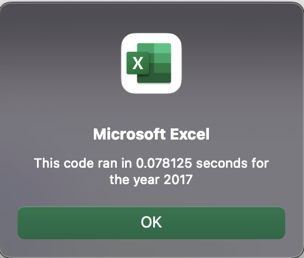

# **REFACTORING EFFECTS ON THE STOCK ANALYSIS PROGRAM**

## ***OVERVIEW***

### Based on the good results we obtained in the previous Stock Analysis workbook we prepared for Steve, the purpose of this analysis is to demonstrate that refactoring the previous program for the stocks analysis we prepared for Steve will have an overall better performance and so it can be used to analyze more than only 12 stocks in the future for Steve.

## ***RESULTS***

### **Stocks Performance between 2017 and 2018**

#### In the following images we can appreciate that 2017 was a much better year for most of the stocks with only TERP at a loss of -7.2%

#### In contrast, we can see a 2018 with a negative return in most of the stocks, with only ENPH and RUN on the positive side. 

#### Based on the analysis we can conclude that Steve should consider investments on ENPH and RUN since they are consistently generating returns in both 2017 and 2018.

### **Original vs Refactored script execution times**

#### Thanks to the refactoring activity we could reduce an overall 74% in the execution time from the previous program as we can see in the images below:

#### Execution time reduction in 2017 went from 0.3212 to 0.0781, which represents a decent -75.7% decrease.

#### Execution time reduction in 2018 went from 0.3022 to 0.0820, which represents a -72.9% reduction.

#### We can check below the refactored code that allowed to do only one reading of the information while storing all data in their respective arrays:

    ''2a) Create a for loop to initialize the tickerVolumes to zero.
    For tickerIndex = 0 To 11
        tickerVolumes(tickerIndex) = 0
    Next tickerIndex
    tickerIndex = 0
    ''2b) Loop over all the rows in the spreadsheet.
    For currentRow = 2 To rowCount
        '3a) Increase volume for current ticker
            If Cells(currentRow, TICKER_COL).Value = tickers(tickerIndex) Then
                tickerVolumes(tickerIndex) = tickerVolumes(tickerIndex) + Cells(currentRow, 8).Value
            End If
        '3b) Check if the current row is the first row with the selected tickerIndex.
            If Cells(currentRow, TICKER_COL).Value = tickers(tickerIndex) And Cells(currentRow - 1, TICKER_COL).Value <> tickers(tickerIndex) Then
                tickerStartingPrices(tickerIndex) = Cells(currentRow, 6).Value
            End If
            '3c) check if the current row is the last row with the selected ticker
             'If the next row’s ticker doesn’t match, increase the tickerIndex.
            If Cells(currentRow, TICKER_COL).Value = tickers(tickerIndex) And Cells(currentRow + 1, TICKER_COL).Value <> tickers(tickerIndex) Then
                tickerEndingPrices(tickerIndex) = Cells(currentRow, 6).Value
                '3d Increase the tickerIndex.
                tickerIndex = tickerIndex + 1
            End If
    Next currentRow

## ***SUMMARY***

### As we can see, refactoring can be very rewarding. Even though we are practically not adding any new funtionality, Refactoring can help us make programs run faster, make it clearer and more easy to read for the user, provides a scalability opportunity and it could bring time and cost savings. On the other hand, it could be a very tough and challenging task to acomplish, it could be time consuming and we might have to retest a lot of the program functionality in order to avoid introducing errors while making changes.

### In our particular case, Refactoring the code of our previous Stock Analysis workbook we prepared for Steve allowed us to reduce a significant amount of time (-74%), which will help Steve to do faster analysis and he could also use the refactored program to analayze more stocks than before. As for the cons part, it took a really long time to be able to refactor the code since it was very time consuming to find the error I made while updating the code, so I had to do a lot of testings before having the code finally refactored.

